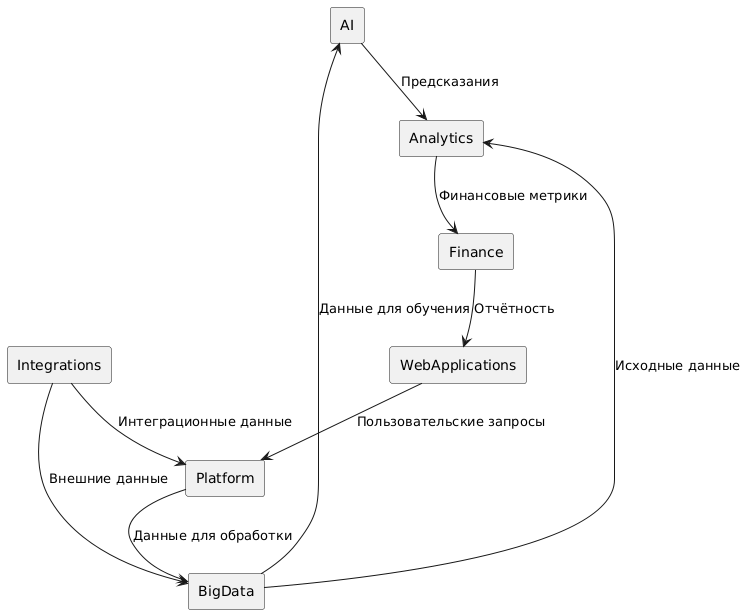

# Domain Data Flow

]

# Разделение на домены

## Домены и зоны ответсвенности

|Домен|Зона ответсвенностии|
|AI|Сопровождение ML-моделей и процессов|
|Finance|Обслуживание финансовых операций и данных|
|Analytics|Создание и сопровождение аналитических моделей, ветрин|
|Integrations|Проработка, настройка и сопровождение интеграций внутренних и внешних|
|Big Data|Сопровождение и развитие LakeHouse|
|Web-Applications|Разработка web-приложений и Backend for frontend|
|Platform|Разработка внутренних сервисов|

## Обоснование

Данное разделение на домены позволяет обеспечить более детальное управление и контроль над каждым доменом. Позволяет быстрее реагировать на изменения и проблемы. Так же способсвует развитию компетенций не по конкретных технологиям и процессов без необходимости широкого охвата, что дает возможность подбирать специалистов под конкретную область. Каждый домен должен быть ответственен за свою зону и быть в состоянии самостоятельно решать поставленные задачи, устранять проблемы и развивать процессы в рамках своего домена.
