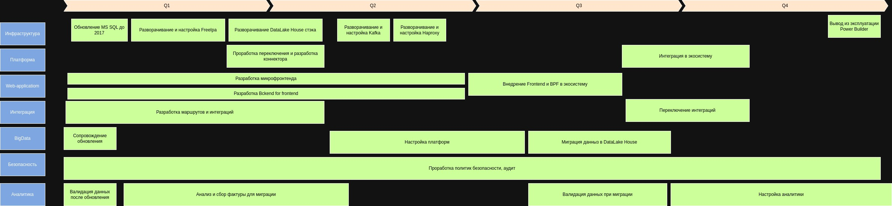

# Technical Radar

|Quadrants|Elements|Rings|
|---|---|---|
|Languages and Frameworks|||
||Python|Adopt|
||Java|Adopt|
||GoLang|Adopt|
||React|Adopt|
|Tools|||
||Apache Iceberg|Trial|
|Platforms & Infrastructure|||
||Apache AirFlow|Trial|
||Apache Kafka|Adopt|
||Apache Spark|Trial|
||Apache Camel|Adopt|
||Minio|Adopt|
||Dremio|Trial|
||DataHub|Trial|
||Nessie|Trial|
||FreeIPA|Adopt|
||Power BI|Adopt|
||Power Builder|Hold|
||Microsoft SQL Server 2008|Hold|
||Microsoft SQL Server 2016|Adopt|
||HAProxy|Adopt|
|Methods & Patterns||
||DDD|Trial|
||Data LakeHouse|Trial|
||Data Lake|Adopt|

# Roadmap

## Обоснование этапов

1. Инфраструктурные задачи (Q1-Q2)
- Разворачивание и настройка Haproxy
    - Обеспечивает балансировку нагрузки
    - Единая точка для доступа к сервисам и контроля
    - Критично для высоконагруженных систем
    - На начальном этапе не критично для целей проекта
- Разворачивание и настройка FreeIPA
    - Централизованная система управления идентификацией и нужно развернуть в первую очередь
    - Обеспечивает безопасность доступа
    - Упрощает управление учетными записями
- Обновление MS SQL до 2017
    - Получение новых функций и улучшений
    - Соответствие современным стандартам безопасности
    - Получение поддержки вендора и обновлений является критичным для компании в целом, пункт выполняется незамедлительно.
2. Платформа и интеграция (Q2-Q3)
- Разворачивание DataLake House
    - Создание хранилища данных
    - Возможность масштабирования
    - Унифицированный подход к хранению данных
    - Выполняется после всех критических задач в приоритете, т.к. от этого зависят другие этапы
- Разворачивание Kafka
    - Обеспечение асинхронной коммуникации
    - Выполняется после всех задач в приоритете
- Разработка маршрутов и интеграций
    - Связывание компонентов системы
    - Обеспечение взаимодействия между сервисами
    - Реализация логики интеграций
    - Домен не сильно нагружен задачами, можно приступись сразу
3. Разработка приложений (Q3)
- Разработка микрофронтенда
    - Модульность интерфейса
    - Независимая разработка компонентов
    - Данную задачу следует выполнять сразу т.к. это новые сервисы от которых зависит бизнес процессы
- Разработка Backend for Frontend
    - Оптимизация клиент-серверного взаимодействия
    - Агрегация данных
    - Повышение безопасности
    - Данную задачу следует выполнять сразу т.к. это новые сервисы от которых зависит бизнес процессы
4. Миграция и аналитика (Q4)
- Миграция данных в DataLake
    - Централизация хранения
    - Унификация форматов
    - Повышение эффективности анализа
    - Данный этап выполняется после разворачивания и настройки DataLake House
- Настройка аналитики
    - Перенос логики с старой системы
    - Заверщающий этап миграции
5. Безопасность и аудит
- Данный процесс должен осуществляться на этапе всего цикла.
